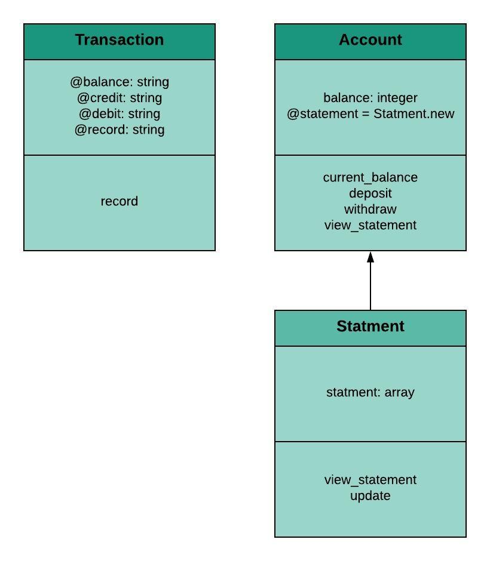

# Bank tech test #

## Getting started ##
- Clone this repository: `git clone git@github.com:JL-J/bank_tech_test.git`
- Change into the repository `cd bank_tech_test`
- Run `bundle install`
- To run the app, require it in irb `require './lib/account'`

```
2.5.1 :001 > require './lib/account'
 => true
2.5.1 :002 > account = Account.new
  => #<Account:0x00007fb2cc9437d0 @balance=0.0, @statement=#<Statement:0x00007fb2cc9437a8 @record_header=["date || credit || debit || balance"], @record=[]>>
2.5.1 :003 > account.deposit(1000)
  => ["12/04/2018 || 1000.00 || || 1000.00"]
2.5.1 :004 > account.deposit(2000)
 => ["12/04/2018 || 1000.00 || || 1000.00", "12/04/2018 || 2000.00 || || 3000.00"]
2.5.1 :005 > account.withdraw(500)
 => ["12/04/2018 || 1000.00 || || 1000.00", "12/04/2018 || 2000.00 || || 3000.00", "12/04/2018 || || 500.00 || 2500.00"]
2.5.1 :006 > account.view_statement
  => ["date || credit || debit || balance", "12/04/2018 || || 500.00 || 2500.00", "12/04/2018 || 2000.00 || || 3000.00", "12/04/2018 || 1000.00 || || 1000.00"]
2.5.1 :007 > puts account.view_statement
   date || credit || debit || balance
   12/04/2018 || || 500.00 || 2500.00
   12/04/2018 || 2000.00 || || 3000.00
   12/04/2018 || 1000.00 || || 1000.00
   => nil
```

## Running tests ##
Tests are written using RSpec. From the command line run `rspec`.

## My approach ##
I used Ruby and RSpec to complete this technical challenge. User stories and TDD helped guide me when completing this project. Following OOD principles, I initially created one class which contained all the features, before refactoring and separating out concerns into three classes (see class diagram below). I used dependancy injection , and classes were tested in isolation using stubs. I have achieved 100% test coverage.     



## Further development ##
This program meets all of the requirements as outlined in the specification. An additional feature which I identified whilst writing the user stories was to not allow a user to withdrawn money they did not have, and therefore stopping them from becoming overdrawn.
